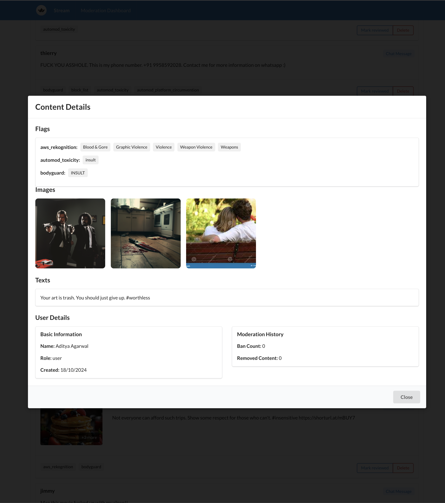

# Build a Custom Moderation Dashboard with Stream

A React-based moderation dashboard for Stream's content moderation system. This dashboard allows moderators to review and manage flagged content efficiently.

<table align="center">
  <tr>
    <td align="center">
      
      <br>
      <em>Review Queue</em>
    </td>
    <td align="center">
      
      <br>
      <em>Content Details</em>
    </td>
  </tr>
</table>

## Features

- Review queue for flagged content
- Content details view with images and text
- User information and moderation history
- Action buttons for quick moderation decisions
- Infinite scroll for content loading
- Reviewed content history

## Prerequisites

- Node.js (v14 or higher)
- npm or yarn
- Stream API credentials

## Setup

1. Clone the repository:
```bash
git clone https://github.com/GetStream/moderation-dashboard-example.git
cd custom-moderation-dashboard
```

2. Install dependencies:
```bash
yarn install
```

3. Create a `.env` file in the root directory and add your Stream API credentials:

```env
REACT_APP_STREAM_API_KEY=your_stream_api_key
REACT_APP_MODERATOR_USER_ID=your_moderator_user_id
REACT_APP_MODERATOR_TOKEN=your_moderator_token
```

5. Start the development server:

```bash
yarn start
```

## Usage

The dashboard provides two main views:

1. **Needs Review**: Shows content that requires moderation
   - View content details
   - Mark as reviewed
   - Delete content

2. **Reviewed**: Shows previously moderated content
   - View historical decisions
   - Review past actions

## Built With

- React
- Stream Chat API
- Semantic UI React
- Lodash
